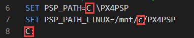
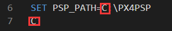

# RflySimModel

## How to use the files.
1. Download and configure the RFlysim platform according to the tutorial of https://rflysim.com/docs/#/en/2_Configuration/SoftwareInstallation

2. Download the source code at https://github.com//RflySim/RFlySimModel

3. Change the platform path of the RflySimSafe model folder software-in-the-loop and hardware-in-the-loop one-key startup script (\HighPrecisionModel\FEISI-X150\FX150_modelHITL(SITL)Run.bat): Specifically,Change the path to the path where the RFlySim file(PX4PSP) is located

4. Copy the 'Model\***\***.dll' file to the 'PX4PSP\CopterSim\external\model' folder
5. run FX150_modelHITL(SITL)Run.bat</li>
6. The same steps apply to the FEISI-X200 and FEISI-X450 files.

